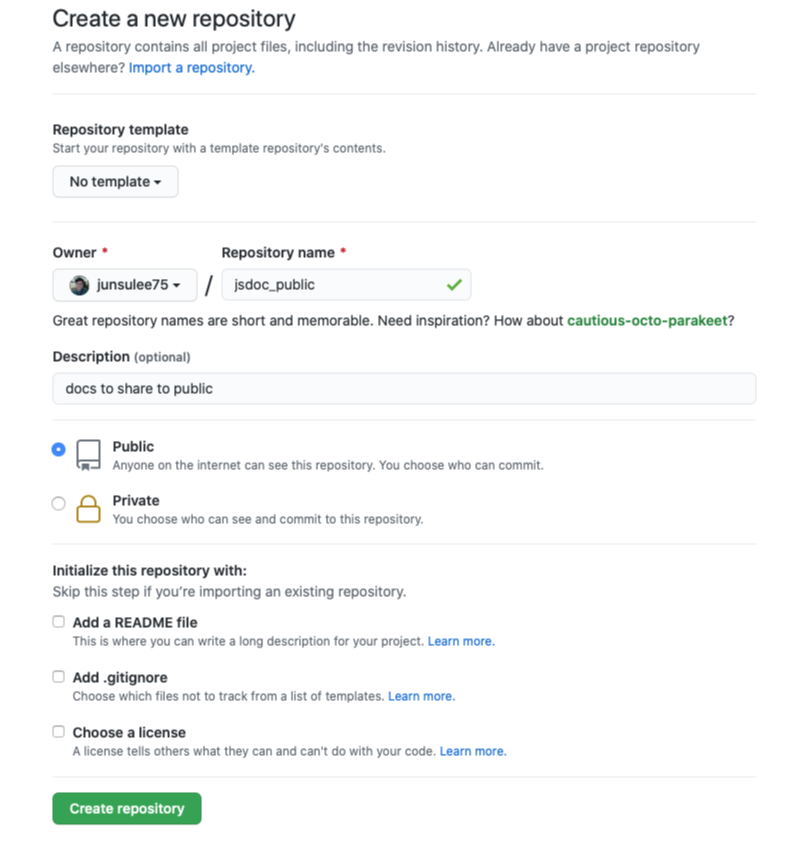
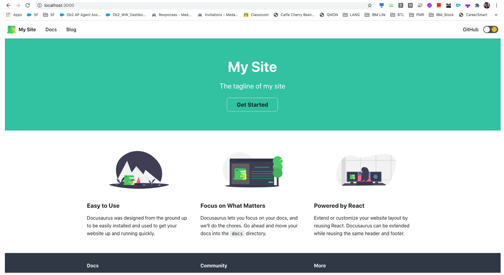
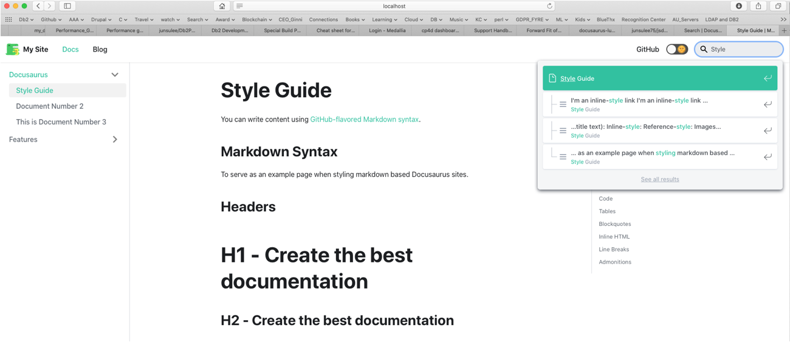

I was hoping to settle in a document framework that satisfies my requirments.     
While I am still keeping looking, `Docusaurus` is the one I found as good as documenting my personal notes.     
This does not have a feature rasing a pull request with a suggested change by other users.    
However, search feature is way better than other frameworks I have used.       
Tell me if you a framework that satifies both, let me know. (lee.junsu@gmail.com)     

The main purpose of this page is tidying up my dirty notes to refer myself in the near future.    
You came to right place if you are looking for free search framework that works with `Docusaurus`.      
I tried some plug-ins from goole search and managed to find one working while others.     
`Docusaurus` suggests a 3rd party plug-in service but I don't like it as I wanted to keep it fully within my framework git repository      
without the dependency such as REST API like search engine.      

Here are steps that work as of now.    

- Reference doc link :    
[Docusaurus V2](https://v2.docusaurus.io/docs/installation/)

## Create new Github repository

Create an empty git repository in advance.     




## Install yarn     
This is optional according to Docusaurus manual. However, I strongly recommend to install.    
No harm and easier to maintain the framework.          

```
brew install yarn
```

## Initialize Docusauraus      
Go to a path where you want to create and run the command.     
I put the name corresponding to the github repository name that I am going to sync with.         

```
jsmacpro15touch:github kr050496$ npx @docusaurus/init@latest init jsdoc_public classic
...

Success! Created jsdoc_public
Inside that directory, you can run several commands:

  yarn start
    Starts the development server.

  yarn build
    Bundles the app into static files for production.

  yarn deploy
    Publish website to GitHub pages.

We suggest that you begin by typing:

  cd jsdoc_public
  yarn start
```


## Start Docusaurus and test default pages.     

Go to the created directory and check the version.   

```
jsmacpro15touch:github kr050496$ cd jsdoc_public
jsmacpro15touch:jsdoc_public kr050496$ npx docusaurus --version
2.0.0-alpha.70
```

Start Docusaurus.  

```
jsmacpro15touch:jsdoc_public kr050496$ yarn start
yarn run v1.22.10
$ docusaurus start
Starting the development server...
Docusaurus website is running at: http://localhost:3000/

✔ Client
  Compiled successfully in 20.80s

ℹ ｢wds｣: Project is running at http://localhost:3000/
ℹ ｢wds｣: webpack output is served from /
ℹ ｢wds｣: Content not from webpack is served from /Users/kr050496/bin/github/jsdoc_public
ℹ ｢wds｣: 404s will fallback to /index.html

✔ Client
  Compiled successfully in 123.95ms
```

It will open the page from a default web browser automatically.    
To visit manually, use the link [http://localhost:3000](http://localhost:3000) .   




## Install search plug-in

As I mentioned earlier, I have tried multiple plug-ins and managed to find one working fine.      
Here is the [github page](https://github.com/easyops-cn/docusaurus-search-local).     
At least, it was good enough to me.     
Hopefully, it does not go away when you refer this page.     

Run the following command to install.     
NOTE : Make sure you use Node.JS version higher than version 12 in the termninal.      
       If the version is lower than that, it would get errors.     

For example, when my node.JS version is lower than 12, it will complain node.JS version.     
```

jsmacpro15touch:jsdoc_public kr050496 $ node -v
v10.15.3


jsmacpro15touch:jsdoc_public kr050496$ yarn add @easyops-cn/docusaurus-search-local
yarn add v1.22.10
[1/4] 🔍  Resolving packages...
[2/4] 🚚  Fetching packages...
error @easyops-cn/docusaurus-search-local@0.14.2: The engine "node" is incompatible with this module. Expected version ">=12". Got "10.15.3"
error Found incompatible module.
info Visit https://yarnpkg.com/en/docs/cli/add for documentation about this command.
```

So I install the latest one to bypass the error.     

```
jsmacpro15touch:~ kr050496$ npm install -g n
/Users/kr050496/Node.js/bin/n -> /Users/kr050496/Node.js/lib/node_modules/n/bin/n
+ n@6.8.0

jsmacpro15touch:~ kr050496$ sudo n 12.18.3
Password:

  installing : node-v12.18.3
       mkdir : /usr/local/n/versions/node/12.18.3
       fetch : https://nodejs.org/dist/v12.18.3/node-v12.18.3-darwin-x64.tar.xz
   installed : v12.18.3 to /usr/local/bin/node
      active : v10.15.3 at /Users/kr050496/Node.js/bin/node

jsmacpro15touch:~ kr050496$ node -v
v10.15.3
jsmacpro15touch:~ kr050496$ /usr/local/bin/node -v
v12.18.3
jsmacpro15touch:~ kr050496$ export PATH=/usr/local/bin:$PATH
jsmacpro15touch:jsdoc_public kr050496$ yarn add @easyops-cn/docusaurus-search-local
```

Then it would be success.    
I recommend to put the new node.JS version to the user profile permanently.    

Then add the following lines to the file `docusaurus.config.js`.   

```
jsmacpro15touch:jsdoc_public kr050496$ cat docusaurus.config.js
..
  plugins: [
    [
      require.resolve("@easyops-cn/docusaurus-search-local"),
      {
        hashed: true,
      },
    ],
  ],
};
```

Build.    
```
yarn build
```

NOTE : 
`yarn start` command will not build indexes for search.    
`npm run serve` command will build indexes.       

When running the test page again, it will show search box.   



## Deply to github

### Configure docusaurus  

Change the docusarus configuration accordingly.    

- Example for my public github repository       
```
jsmacpro15touch:jsdoc_public kr050496$ cat docusaurus.config.js
module.exports = {
  title: 'Jun Su\'s notes (Public)',
  tagline: 'My personal notes to share to public.',
  url: 'https://junsulee75.github.io',
  baseUrl: '/jsdoc_public',  
  onBrokenLinks: 'throw',
  onBrokenMarkdownLinks: 'warn',
  favicon: 'img/favicon.ico',
  organizationName: 'junsulee75', // Usually your GitHub org/user name.
  projectName: 'jsdoc_public', // Usually your repo name.
  themeConfig: {
    navbar: {
..
```

- Example for my internal IBM github repository pattern.     
```
module.exports = {
  title: 'Jun Su\'s technical notes (Internal)',
  tagline: 'My personal note to share or present occasionally.',
  url: 'https://pages.github.ibm.com',
  //baseUrl: '/junsulee/jsdoc_internal/',   // This failed before but now this works (2021-01-28), But this does not work for local mode test
  baseUrl: '/',   // This worked somehow ? Full URL : https://pages.github.ibm.com/junsulee/jsdoc_internal/ , not working (2021-01-28) , working for local test
  onBrokenLinks: 'throw',
  onBrokenMarkdownLinks: 'warn',
  favicon: 'img/favicon.ico',
  organizationName: 'junsulee', // Usually your GitHub org/user name.
  projectName: 'jsdoc_internal', // Usually your repo name.
```


### Git configuration   
Link the Docusaurus working directory to the github repository.     
```
jsmacpro15touch:jsdoc_public kr050496$ echo "# jsdoc_public" >> README.md
jsmacpro15touch:jsdoc_public kr050496$ git init
jsmacpro15touch:jsdoc_public kr050496$ git remote -v
jsmacpro15touch:jsdoc_public kr050496$ git remote add origin git@github.com:junsulee75/jsdoc_public.git
jsmacpro15touch:jsdoc_public kr050496$ git remote -v
origin    git@github.com:junsulee75/jsdoc_public.git (fetch)
origin    git@github.com:junsulee75/jsdoc_public.git (push)
```


### Git deploy

- Example for my public github repository    
```
jsmacpro15touch:jsdoc_public kr050496$ GIT_USER=junsulee75 yarn deploy
```

- Example for my internal IBM github repository pattern.   

```
$ GITHUB_HOST=github.ibm.com GIT_USER=junsulee yarn deploy
```

## Visit deployed page 

