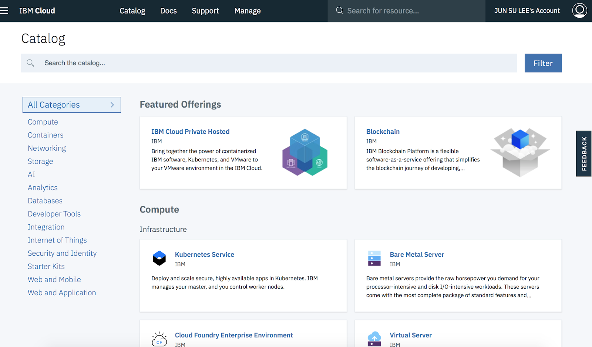
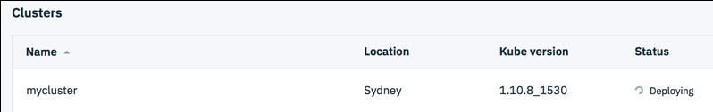
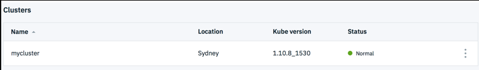

Migrating my old article written on Dec.13, 2018 from other blog sites.    
This is quite old doc but over streams remain similar.    

Recent few year's technologies are moving faster than the things that had happened last 20 years.    
Among those, I am writing this page regarding how to start to create environment on your working laptop and interact with Kubernetes cluster in IBM cloud.   
Basically, the steps are followed by the course "Container & Kubernetes Essentials with IBM Cloud".    
I know these are basic stuffs.     
But during the hands on, I had few things that took my time to figure out some of trial and errors.     
Therefore I hope this page could be useful as a supplement document that saves your time in the same occurrences.  

Firstly, I think it's better to share the example to create Kubenetes cluster environment in IBM Cloud     
and the steps to setup your laptop environment based on the access information to the created cluster.    
The overall steps would be conceptually similar to other clouds such as AWS and Google cloud.     
(Note : This is the 1st version of document and will be updated if things change. )     


## 1. Create Kubenetes cluster. 

Simpler than cooking an instant noodle.

Log in [IBM Cloud](https://cloud.ibm.com).   
From 'Catalog' menu, choose 'Kubernetes service'.
Then create the cluster giving the name.  ( 'mycluster' in my example. )     



The screen during the deployment. ( It takes minutes. )



Once it's done, you will see this status that means your Kubenetes cluster is ready.   



When you click 'Access' tab, you will see the brief steps/commands how you access the cluster from your laptop.     
I omit this as I will describe this later.   
Beforehand, you will need to install some software stacks.

## 2. Install softwares on your laptop.    


In short, we need IBM cloud CLI ( command line interface ) and Kubernetes interface.    
I assume you already have at least Docker community edition installed in your laptop.    
You may refer the page [IBM Cloud CLI](https://cloud.ibm.com/docs/cli/index.html#overview), Version 0.5.0 or later for the detail.          
Regard '$' as the command prompt to run commands.   

The following commands install many relevant softwares and plug-in.

### 2-1. Install IBM Cloud CLI 

After this you can use 'ibmcloud' command.

```
$ curl -sL https://ibm.biz/idt-installer| bash
```

### 2-2. IBM Cloud Kubernetes Service plug-in
```
$ ibmcloud plugin install container-service -r Bluemix
```

### 2-3. IBM Cloud Container Registry plug-in

```
$ ibmcloud plugin install container-registry -r Bluemix
```

### 2-4. Check installed plugin so far

```
$ ibmcloud plugin list
   Listing installed plug-ins...

Plugin Name                            Version   Status   
cloud-functions/wsk/functions/fn       1.0.24       
container-registry                     0.1.341      
container-service/kubernetes-service   0.1.635      
dev                                    2.1.8        
sdk-gen                                0.1.12  
```

### 2-5. Install Kubenetes CLI softwares ( 'kubectl' )

This is from Kubernetes web site and not IBM cloud dependant.
        
Refer to the page [Kubernetes CLI](https://kubernetes.io/docs/tasks/tools/install-kubectl/).
In short, only one command to install.

```
$ brew install kubernetes-cli 
$ kubectl version
```

## 3. Access to your Kubernetes cluster

When I created the cluster, it seems my cluster was located to Sydney region from the provided API point.    
By the way, I set up my access point and login.    

### 3-1. Login with the provided URL from you cluster and set region as advised.
Once it's set once, you can use simple command `ibmcloud login` next time.

```
$ ibmcloud login -a https://api.au-syd.bluemix.net
API endpoint: https://api.au-syd.bluemix.net

Email> junsulee@au1.ibm.com

Password>  <== XXXXX
Authenticating...
OK

Targeted account JUN SU LEE's Account (bf384e9f77ea0cd3b2268cbc7a1b8871)

Targeted resource group default

                      
API endpoint:      https://api.au-syd.bluemix.net
Region:            au-syd   
User:              junsulee@au1.ibm.com
Account:           JUN SU LEE's Account (bf384e9f77ea0cd3b2268cbc7a1b8871)   
Resource group:    default   
CF API endpoint:      
Org:                  
Space:                
..


$ ibmcloud cs region-set ap-south
```


### 3-2. Download Kubenetes cluster configuration file.
This will download and show the yaml file path with export command to set the client working environment.

```
$ ibmcloud cs cluster-config mycluster
OK
The configuration for mycluster was downloaded successfully.

Export environment variables to start using Kubernetes.

export KUBECONFIG=/Users/kr050496/.bluemix/plugins/container-service/clusters/mycluster/kube-config-mel01-mycluster.yml
```

### 3-3. Set 'KUBECONFIG' environment and confirm if you can get the Kubenetes node name.

```
$ export KUBECONFIG=/Users/kr050496/.bluemix/plugins/container-service/clusters/mycluster/kube-config-mel01-mycluster.yml


$ kubectl get nodes
NAME            STATUS   ROLES    AGE   VERSION
10.118.181.83   Ready    <none>   9d    v1.10.8+IKS
```


## 4. Push an Docker Image to IBM Cloud container registry

### 4-1. Need to login container registry

```
    $ ibmcloud cr login
```

### 4-2. Create your name space for uploading the image.
I used 'js_namespace' here.   

```
$ ibmcloud cr namespace-add js_namespace
```


### 4-3. Build a Docker image.
This could be any Docker image you have.    
Here, I just used popular 'hello-world' app docker source files.    
You can download the files from this github page.   

```
$ docker build --tag registry.au-syd.bluemix.net/js_namespace/hello-world .

$ docker images
REPOSITORY                                             TAG                 IMAGE ID            CREATED             SIZE
registry.au-syd.bluemix.net/js_namespace/hello-world   latest              c8d3ce58b2f0        3 minutes ago       77.4MB
node                                                   9.4.0-alpine        b5f94997f35f        10 months ago       68MB
```

### 4-4. Push the Docker image to container registry of your IBM cloud.

```
$ docker push registry.au-syd.bluemix.net/js_namespace/hello-world

The push refers to repository [registry.au-syd.bluemix.net/js_namespace/hello-world]
dfed013c3a66: Pushed
43c75a864aef: Pushed
a5e384757789: Pushed
0804854a4553: Pushed
6bd4a62f5178: Pushed
9dfa40a0da3b: Pushed
latest: digest: sha256:03555979df6473d6bac5bd96aa567b732f5812bcec21d7849fd0a8df0d5260e4 size: 1576
```

## 5. Deploy the application to your Kubernetes cluster

### 5-1. Make sure Kubernetes cluster is ready.

```
$ ibmcloud cs clusters
OK
Name        ID                                 State    Created      Workers   Location   Version       Resource Group Name   
mycluster   fc8d5b31551f40c393bb55dfbc7dacf1   normal   1 week ago   1         mel01      1.10.8_1530   default
```

### 5-2. Run the image as a deployment

```
$ kubectl run hello-world--image=registry.au-syd.bluemix.net/js_namespace/hello-world

kubectl run --generator=deployment/apps.v1beta1 is DEPRECATED and will be removed in a future version. Use kubectl create instead.
deployment.apps/hello-world created
```

### 5-3. Check if the deployed application is running.
( `Pods` is a kind of real running instance of the application image. )

```
$ kubectl get pods
NAME                         READY   STATUS    RESTARTS   AGE
hello-world-b5f57696-tw69g   1/1     Running   0          1m
```

### 5-4. Expose that deployment as a service, which is accessed through the IP of the worker nodes. 
The example for this lab listens on port 8080. Run this command:    

```
$ kubectl expose deployment/hello-world --type="NodePort" --port=8080
service/hello-world exposed
```

### 5-5. Find the port that is used on that worker node and examine your new service

```
$ kubectl describe service hello-world
Name:                     hello-world
Namespace:                default
Labels:                   run=hello-world
Annotations:              <none>
Selector:                 run=hello-world
Type:                     NodePort
IP:                       172.21.221.176
Port:                     <unset>  8080/TCP
TargetPort:               8080/TCP
NodePort:                 <unset>  32115/TCP
Endpoints:                172.30.209.7:8080
Session Affinity:         None
External Traffic Policy:  Cluster
Events:                   <none>
```

### 5-6. Find public IP

```
$ ibmcloud cs workers mycluster
OK
ID                                                 Public IP       Private IP      Machine Type   State    Status   Zone    Version   
kube-mel01-pafc8d5b31551f40c393bb55dfbc7dacf1-w1   168.1.144.249   10.118.181.83   free           normal   Ready    mel01   1.10.8_1531*   
```

### 5-7. Run application

(CLI example)
```
$ curl 168.1.144.249:32115
Hello world from hello-world-b5f57696-tw69g! Your app is up and running in a cluster!
```

(From Web browser),

 


## 6. Scale apps with replicas

Now, we about about to test replicating the applications that is one of main reason using Kubernetes.   
This is how it looks like.   

### 6-1. Edit the application profile to have multiple replicas.

This command opens editor like vi.    

```
$ kubectl edit deployment/hello-world

..
apiVersion: extensions/v1beta1
kind: Deployment
metadata:
  annotations:
    deployment.kubernetes.io/revision: "1"
  creationTimestamp: 2018-12-02T08:12:32Z
  generation: 1
  labels:
    run: hello-world
  name: hello-world
  namespace: default
  resourceVersion: "89518"
  selfLink: /apis/extensions/v1beta1/namespaces/default/deployments/hello-world
  uid: 0500e431-f60a-11e8-a202-96b9c26aee95
spec:
  progressDeadlineSeconds: 600
  replicas: 1                 <== change this line from 1 to 10
```

If you save by `wq:`, it shows the following message.      

```
..
"/private/var/folders/3s/twhgptds155072zvjvs4q8j40000gn/T/kubectl-edit-ixhu1.yaml" 67L, 1935C written
deployment.extensions/hello-world edited
```

### 6-2. Now, check the application status again.   
Then you will see 10 Pods are running as we changed.    
( It may take seconds until you see the output similar to this. )       

```
$ kubectl rollout status deployment/hello-world
deployment "hello-world" successfully rolled out

$ kubectl get pods
NAME                         READY   STATUS    RESTARTS   AGE
hello-world-b5f57696-2gwkp   1/1     Running   0          2m
hello-world-b5f57696-2vb6x   1/1     Running   0          2m
hello-world-b5f57696-86bdz   1/1     Running   0          2m
hello-world-b5f57696-9xcss   1/1     Running   0          2m
hello-world-b5f57696-g96sw   1/1     Running   0          2m
hello-world-b5f57696-hvd2f   1/1     Running   0          2m
hello-world-b5f57696-jncsm   1/1     Running   0          2m
hello-world-b5f57696-mdnkw   1/1     Running   0          2m
hello-world-b5f57696-tc6k5   1/1     Running   0          2m
hello-world-b5f57696-tw69g   1/1     Running   0          19m
```


## 7. Update and rollback apps
Kubernetes allows you to use a rollout to update an app deployment with a new Docker image.      
This allows you to easily update the running image and also allows you to easily undo a rollout if a problem is discovered after deployment.     

### 7-1.  Building new docker image and push to IBM cloud container registry.

Let me build two more docker images tagging ":1" and ":2" to differentiate from the previous version.    
This is actually same build but I will pretend these are different version just for demonstration purpose.     

```
$ docker build --tag registry.au-syd.bluemix.net/js_namespace/hello-world:1 .

Sending build context to Docker daemon  15.36kB
Step 1/6 : FROM node:9.4.0-alpine
---> b5f94997f35f
Step 2/6 : COPY app.js .
---> Using cache
---> 0bdfcf16e9c0
Step 3/6 : COPY package.json .
---> Using cache
---> b7a6a0b93944
Step 4/6 : RUN npm install &&    apk update &&    apk upgrade
---> Using cache
---> 4c0b6dad22d4
Step 5/6 : EXPOSE  8080
---> Using cache
---> bda855584f19
Step 6/6 : CMD node app.js
---> Using cache
---> c8d3ce58b2f0
Successfully built c8d3ce58b2f0
Successfully tagged registry.au-syd.bluemix.net/js_namespace/hello-world:1
```

Now, you see one more build.

```
$ docker images
REPOSITORY                                             TAG                 IMAGE ID            CREATED             SIZE
registry.au-syd.bluemix.net/js_namespace/hello-world   1                   c8d3ce58b2f0        4 hours ago         77.4MB
registry.au-syd.bluemix.net/js_namespace/hello-world   latest              c8d3ce58b2f0        4 hours ago         77.4MB
node                                                   9.4.0-alpine        b5f94997f35f        10 months ago       68MB
```

Then, I will push this new image to IBM cloud container registry.     

```
$ docker push registry.au-syd.bluemix.net/js_namespace/hello-world:1
The push refers to repository [registry.au-syd.bluemix.net/js_namespace/hello-world]
dfed013c3a66: Layer already exists
43c75a864aef: Layer already exists
a5e384757789: Layer already exists
0804854a4553: Layer already exists
6bd4a62f5178: Layer already exists
9dfa40a0da3b: Layer already exists
1: digest: sha256:03555979df6473d6bac5bd96aa567b732f5812bcec21d7849fd0a8df0d5260e4 size: 1576
```


In the same way, let me build one more version tagging as ":2".     
Finally, I will use this for the test.      

```
$ docker build --tag registry.au-syd.bluemix.net/js_namespace/hello-world:2 .

Sending build context to Docker daemon  15.36kB
Step 1/6 : FROM node:9.4.0-alpine
---> b5f94997f35f
Step 2/6 : COPY app.js .
---> Using cache
---> 0bdfcf16e9c0
Step 3/6 : COPY package.json .
---> Using cache
---> b7a6a0b93944
Step 4/6 : RUN npm install &&    apk update &&    apk upgrade
---> Using cache
---> 4c0b6dad22d4
Step 5/6 : EXPOSE  8080
---> Using cache
---> bda855584f19
Step 6/6 : CMD node app.js
---> Using cache
---> c8d3ce58b2f0
Successfully built c8d3ce58b2f0
Successfully tagged registry.au-syd.bluemix.net/js_namespace/hello-world:2


$ docker images
REPOSITORY                                             TAG                 IMAGE ID            CREATED             SIZE
registry.au-syd.bluemix.net/js_namespace/hello-world   1                   c8d3ce58b2f0        4 hours ago         77.4MB
registry.au-syd.bluemix.net/js_namespace/hello-world   2                   c8d3ce58b2f0        4 hours ago         77.4MB
registry.au-syd.bluemix.net/js_namespace/hello-world   latest              c8d3ce58b2f0        4 hours ago         77.4MB
node                                                   9.4.0-alpine        b5f94997f35f        10 months ago       68MB


$ docker push registry.au-syd.bluemix.net/js_namespace/hello-world:2

The push refers to repository [registry.au-syd.bluemix.net/js_namespace/hello-world]
dfed013c3a66: Layer already exists
43c75a864aef: Layer already exists
a5e384757789: Layer already exists
0804854a4553: Layer already exists
6bd4a62f5178: Layer already exists
9dfa40a0da3b: Layer already exists
2: digest: sha256:03555979df6473d6bac5bd96aa567b732f5812bcec21d7849fd0a8df0d5260e4 size: 1576
```

### 7-2.  Roll out new image to Kubenetes cluster.

So far, I have only pushed this image into the container registry only but didn't roll out to Kubenetes service cluster.     

To apply new image, there are two ways.    

(1) Edit the Kubenetes application profile and save. ( Edit the image name line )    

```
$ kubectl edit deployment/hello-world

..
    spec:
      containers:
     - image: registry.au-syd.bluemix.net/js_namespace/hello-world:2
```

(2) By commands.
```

$ kubectl set image deployment/hello-world hello-world=registry.au-syd.bluemix.net/js_namespace/hello-world:2
deployment.extensions/hello-world image updated
..

$ kubectl rollout status deployment/hello-world
deployment "hello-world" successfully rolled out
```

Can you guess what would happen then ?     
Yes, the existing replicasets moved to sets with new image.     
I hoped to capture the progress of the movement but it was too fast, so I show the result output after the movement.     

```
$ kubectl get replicasets
NAME                     DESIRED   CURRENT   READY   AGE
hello-world-854fc7484d   10        10        10      1m    <= new
hello-world-b5f57696     0         0         0       34m   <= old
```

### 7-3.  Roll out new image to Kubenetes cluster.

Running the application confirms we are running on the new image.     
```
$ curl 168.1.144.249:32115
Hello world from hello-world-854fc7484d-qnxf8! Your app is up and running in a cluster!
```

### 7-4. Roll back apps
Let's assume the scenario that something goes wrong with new apps image.      
Here, one single quick command to rollback the change.      
At this time, I am more prepared to run the command in shorter interval to show the progress.    

```
$ kubectl rollout undo deployment/hello-world
deployment.extensions/hello-world

jsmacpro15retina:Lab 1 kr050496$ kubectl get replicasets
NAME                     DESIRED   CURRENT   READY   AGE
hello-world-854fc7484d   6         6         6       3m
hello-world-b5f57696     7         7         2       36m

jsmacpro15retina:Lab 1 kr050496$ kubectl get replicasets
NAME                     DESIRED   CURRENT   READY   AGE
hello-world-854fc7484d   4         4         4       3m
hello-world-b5f57696     9         9         4       37m

jsmacpro15retina:Lab 1 kr050496$ kubectl get replicasets
NAME                     DESIRED   CURRENT   READY   AGE
hello-world-854fc7484d   4         4         4       3m
hello-world-b5f57696     9         9         4       37m

jsmacpro15retina:Lab 1 kr050496$ kubectl get replicasets
NAME                     DESIRED   CURRENT   READY   AGE
hello-world-854fc7484d   4         4         4       4m
hello-world-b5f57696     9         9         4       37m

jsmacpro15retina:Lab 1 kr050496$ kubectl get replicasets
NAME                     DESIRED   CURRENT   READY   AGE
hello-world-854fc7484d   2         2         2       4m
hello-world-b5f57696     10        10        6       37m

jsmacpro15retina:Lab 1 kr050496$ kubectl get replicasets
NAME                     DESIRED   CURRENT   READY   AGE
hello-world-854fc7484d   2         2         2       4m
hello-world-b5f57696     10        10        7       37m

jsmacpro15retina:Lab 1 kr050496$ kubectl get replicasets
NAME                     DESIRED   CURRENT   READY   AGE
hello-world-854fc7484d   0         0         0       4m
hello-world-b5f57696     10        10        8       37m

jsmacpro15retina:Lab 1 kr050496$ kubectl get replicasets
NAME                     DESIRED   CURRENT   READY   AGE
hello-world-854fc7484d   0         0         0       4m
hello-world-b5f57696     10        10        10      37m

```

Now we went back to the previous image running mode.    
Thank you for reading this.     


